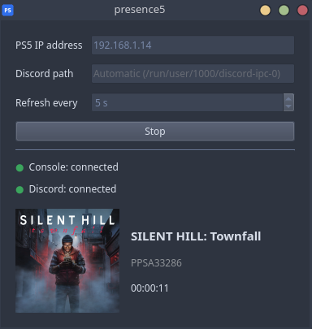
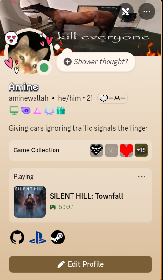

# Presence5

A PS5 payload that works alongside a desktop client to display your game activity on Discord
through its Rich Presence feature.

| Client preview | Discord preview |
| :---: | :---: |
|  |  |

The payload runs on the console and reports which game is open and for how long. The client runs
on your PC, asks the payload every few seconds, and passes the result to your local Discord app.

## Setup

Please note that this has only been tested on firmware 13.60, CachyOS and Windows 11. I will be
more than happy to fix any issues that come up, so feel free to open one.

### What you will need

- The latest payload (`presence.elf`) and client from the
  [releases page](https://github.com/AmineWallah/presence5/releases). Either the GUI or the CLI
  client will do the job.
- A jailbroken PS5 with an ELF loader.
- The Discord desktop app, open on the same PC as the client. The browser version will not work.
- Your PS5 and your PC on the same local network.
- **Optional but recommended:** [PS5 Payload Manager](https://github.com/itsPLK/ps5-payload-manager)

### 1. Load the payload on the PS5
**It is VERY RECOMMENDED to load it with PS5 Payload Manager, but if you do not have access to it:**

Send `presence.elf` to your ELF loader, which usually listens on port 9021. Replace `<PS5_IP>`
with your console's IP address, found on the PS5 under
Settings > Network > Connection Status > View Connection Status.

```sh
nc -q0 <PS5_IP> 9021 < presence.elf
```

If your version of `nc` does not accept `-q0`, use `-N` or `-w 1` in its place.


A "Server initialized" notification on the console means the payload is running. It keeps
running until the console is turned off or restarted, so it needs to be loaded again after each
jailbreak.

To stop the payload without restarting the console:

```sh
echo QUIT | nc -w 1 <PS5_IP> 8000
```

### 2. Run the client on your PC

Make sure Discord is open, and that activity sharing is turned on in Discord under
Settings > Activity Privacy.

#### GUI

| System | How to start it |
| --- | --- |
| Linux | `chmod +x presence5-linux`, then `./presence5-linux` |
| Windows | Double-click `presence5-windows.exe` |

Enter your PS5's IP address and press **Start**. The game you are playing shows up in the window
and on your Discord profile within a few seconds.

Closing the window sends the client to the system tray, where it keeps running. Click the tray
icon to bring the window back, or right-click it and choose **Quit** to exit.

#### CLI

```sh
# Linux
chmod +x presence5-linux-cli
./presence5-linux-cli <PS5_IP>

# Windows
presence5-cli.exe <PS5_IP>
```

| Option | Description |
| --- | --- |
| `-i`, `--interval SECONDS` | How often to ask the console for its state. Default: 5. |
| `-d`, `--discord PATH` | Path to Discord's IPC socket or pipe, if it is not found automatically. |
| `-v`, `--verbose` | Print debug output. Useful when reporting an issue. |

Press Ctrl+C to stop it.

The client does not have to be started after the payload. If the console or Discord is not
available, it keeps retrying until they are.

## Build from source

### Payload

You need the [PS5 Payload SDK](https://github.com/ps5-payload-dev/sdk) installed, with the
`PS5_PAYLOAD_SDK` environment variable pointing at it.

```sh
export PS5_PAYLOAD_SDK=/opt/ps5-payload-sdk
make -C payload
```

This produces `payload/presence.elf`.

### Client

You need Python 3.10 or newer and [uv](https://docs.astral.sh/uv/).

```sh
uv sync

# Run from source
uv run client/gui.py
uv run client/main.py <PS5_IP>

# Build standalone executables into dist/
uv run pyinstaller --onefile --windowed --name presence5 client/gui.py
uv run pyinstaller --onefile --name presence5-cli client/main.py
```

Executables are built for the system you run the build on, so the Windows ones have to be built
on Windows and the Linux ones on Linux.

## How the titles are resolved

The payload only knows a game's title ID, such as `PPSA17221` or `CUSA00900`. The client turns
that into a name and a cover image by trying these sources in order:

1. **The game's own `param.json`, read from the console.** This covers PS5 games and homebrew.
   The name comes from the file, and the cover is fetched from the PlayStation Store using the
   content ID found in it.
2. **Sony's title metadata service, looked up by title ID.** This covers PS4 games, which have no
   `param.json`.
3. **The title ID on its own,** if neither of the above returns anything.

Results are remembered while the client is running, so each game is only looked up once.

The two Sony services used here are not officially documented. If they change, names or covers
may stop appearing until the client is updated. Game detection and the timer do not depend on
them.

## Credits

- [PS5 Payload SDK](https://github.com/ps5-payload-dev/sdk) by John Törnblom, used to build the
  payload.
- [etaHEN](https://github.com/etaHEN/etaHEN) by LightningMods, whose Discord RPC server this
  payload's game detection is based on.
- [PS5 Payload Manager](https://github.com/itsPLK/ps5-payload-manager) by itsPLK.

## License

Presence5 is released under the GNU General Public License, version 3 or later. See
[LICENSE](./LICENSE) for the full text.